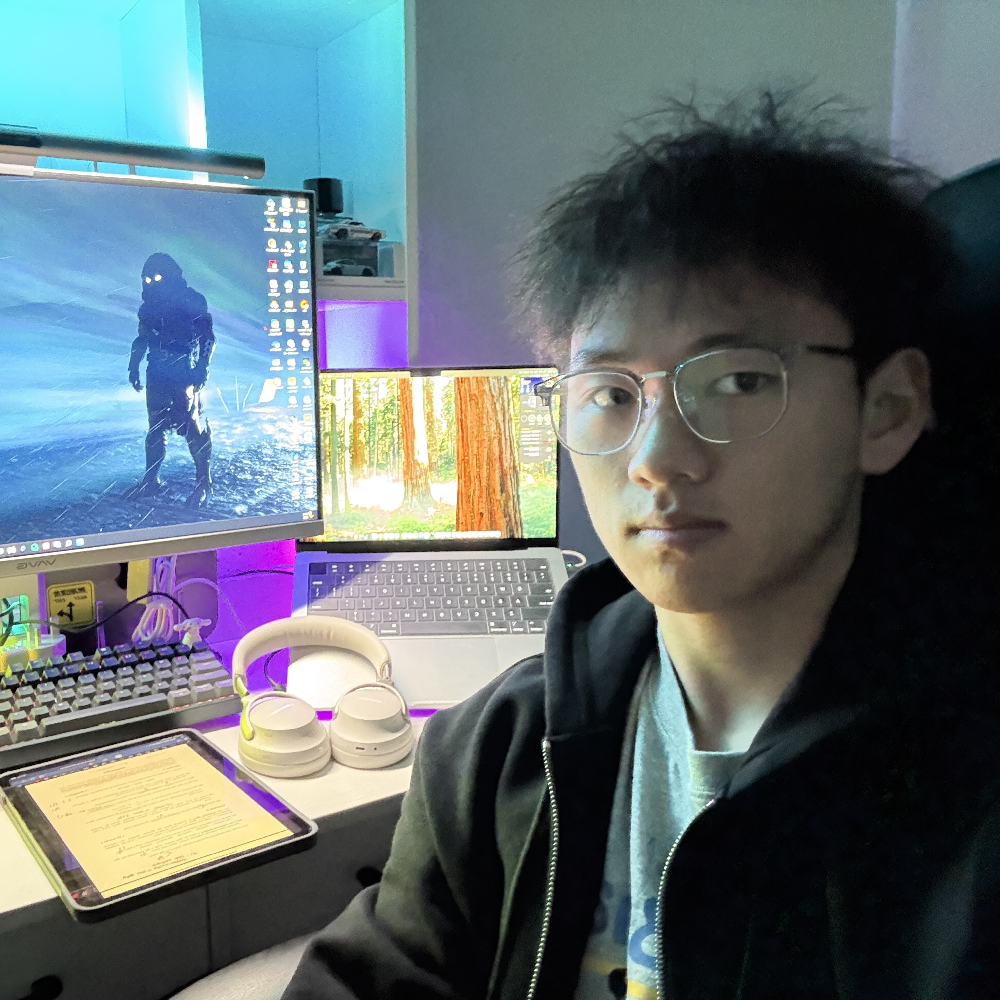

# WeGreen AI

It is a intro of WeGreen AI

# Sponsor

## Hong Kong Baptist University

# Our Team Members

## Ken Law Chun Hei (Business Development)

**Academic Background:**

1. HKBU BBA - Economics & Data Analytics & FinTech
2. HKCC Associate in Business (Finance)

**Experience:**

1. CTgoodjobs Future Leader Awards 2024 - Finalist
2. Business Strategic Planning Assistant - HK01
3. Senior Tutor (AI & Media literacy) - HK01 Edu
4. The 2nd City I&T Grand Challenge - Pri&Sec Organizer

**LinkedIn:** [Go to LinkedIn](https://www.linkedin.com/in/kenlaw2002/)

---

## Ryan Lin Chun Yin (Product Development)

**Academic Background:**

1. HKBU BSc - Green Energy and Smart Technology
2. UOW Associate of Engineering

**Experience:**

1. Waste Classification System Engineering project

**Skills:**

1. Coding language: Java, C++, Python
2. IoT Building AND Machine learning

---

## Hiko Li Yanpei (Product Development)

**Academic Background:**

1. HKMU BSc - Computer Engineering
2. UOW Associate of Engineering

**Experience:**

1. Cloud-based robot delivery management system
2. AI assistant job search system Project

**Skills:**

1. Mainly Typescript & Python
2. Frontend + Backend Building

**Personal Web Page:** [Go to Personal Web Page](https://hiko.dev)  
**Github:** [Go to Personal Github](https://github.com/HikoPLi)  
**LinkedIn:** [Go to LinkedIn](https://www.linkedin.com/in/liyanpeihiko/)
